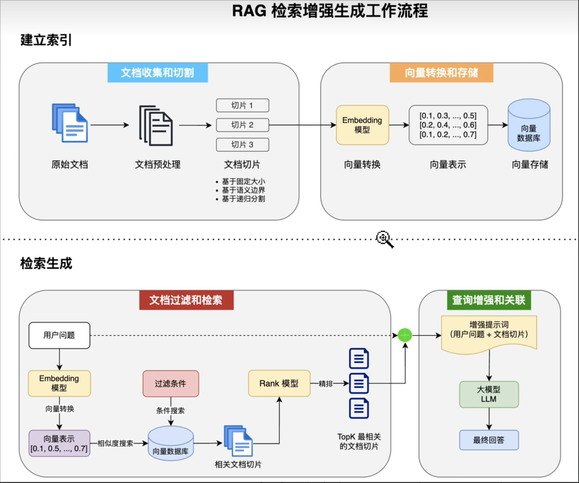

# AI Coder Helper

## 项目介绍

AI Coder Helper 是一个基于 Spring Boot 和 LangChain4j 开发的 AI 辅助编程工具，旨在帮助开发者通过与 AI 模型交互来提高编程效率。

## 技术栈

- **后端框架**: Spring Boot 3.5.0
- **Java 版本**: Java 21
- **AI 框架**: LangChain4j 1.1.0
- **AI 模型**: OpenAI (配置为 deepseek)
- **构建工具**: Maven
- **其他依赖**: Lombok


## 核心功能


## 开发说明


### 依赖说明

- **langchain4j-open-ai**: 提供与 OpenAI 模型交互的能力
- **langchain4j**: 核心 AI 框架
- **langchain4j-spring-boot-starter**: Spring Boot 集成
- **spring-boot-starter-web**: 提供 Web 服务能力

## 注意事项

1. **API 密钥安全**
   - 确保在 `application-local.yml` 文件中的 API 密钥不会被提交到版本控制系统
   - 建议使用环境变量或密钥管理服务来存储敏感信息

3. **性能优化**
   - 对于频繁的 AI 交互，考虑添加缓存机制
   - 监控 API 调用频率，避免超出 AI 服务提供商的限制


## 许可证

本项目采用 MIT 许可证。

## 联系方式

如有问题或建议，欢迎联系项目维护者。

## 知识点记录

### 1. Multimodal

在 LangChain4j 中，“多模态”（Multimodal） 指的是模型能够同时处理、理解或生成多种不同类型的数据流，而不仅仅是传统的纯文本。

**核心组成**：
- `TextContent`：用于处理文本数据的内容
- `ImageContent`：用于处理图像数据的内容
- `AudioContent`：用于处理音频数据的内容
- `VideoContent`：视频内容
- `PdfFileContent`: 用于处理 PDF 文件的内容

**使用示例**：
```java
UserMessage userMessage = UserMessage.from(
                TextContent.from("描述图片"),
                ImageContent.from("https://pic.rmb.bdstatic.com/bjh/251230/dump/c17400d248be707cbc4c591ae51b21a8.jpeg")
        );
ChatResponse chatResponse = deepseekChatModel.chat(userMessage);
AiMessage aiMessage = chatResponse.aiMessage();
return aiMessage.text();
```
### 2. System Message

系统消息（System Message） 是在与 AI 模型交互时，用于设置模型行为和上下文的特殊消息。

**作用**：
- 定义模型的角色和行为
- 提供模型理解任务的背景信息
- 控制模型的响应行为

**使用示例**：
```java
SystemMessage systemMessage = SystemMessage.from("你是一个专业的编程助手，帮助用户解决编程问题。");

ChatResponse chatResponse = deepseekChatModel.chat(systemMessage,userMessage);

```

**优化提示词**

| 维度 | 作用 | 关键技巧 |
|-----|-----|-----|
| 1. 角色定义   |  让 AI 明确身份和专长   |  指定专业领域、经验年限、技能组合   | 
|  2. 上下文提供   |   提供必要的背景信息  |  项目背景、具体问题、已尝试方案   | 
| 3. 输出格式指定    |   控制输出的结构  |  明确层次、长度、格式要求   | 
| 4. 约束条件设置 |   限制回答范围  |  技术栈限制、代码规范、长度控制   | 
| 5. 示例提供  |   通过示例引导输出样式  | 2-3个相关示例，覆盖不同场景 | 
| 6. 思维链引导    |   引导 AI 逐步思考  |  分步骤分析，展示推理过程   | 
| 7. 迭代优化    |   多轮对话完善答案  |  补充信息 → 改进 → 验证   | 
| 8. 负面提示    |   明确告诉 AI 不要做什么  |  列出排除项，限制深度广度   | 

**附加内容**
- 综合示例 ：展示如何在一个提示词中综合运用多种技巧
- 常见错误表 ：列出5种常见错误及改进方法
- 最佳实践总结 ：8条可操作的实践建议
**💡 使用建议**
1. 从简单开始 ：先尝试角色定义 + 上下文提供
2. 逐步添加 ：根据效果逐步增加其他维度
3. 组合使用 ：多种技巧组合效果最佳
4. 持续优化 ：根据 AI 的回答质量不断调整提示词

### 3. ChatMemory 会话记忆

在 LangChain4j 中，"会话记忆"（ChatMemory）用于在多轮对话中保持上下文，让 AI 能够记住之前的对话内容。

**核心作用**：
- 保持对话的连续性和上下文
- 支持多轮交互，避免重复提供背景信息
- 实现更自然的对话体验

**核心组成**：
- `ChatMemory`：会话记忆接口
- `Message`：存储在记忆中的消息（包括 UserMessage、AiMessage、SystemMessage）
- `maxMessages`：设置记忆的最大消息数量，防止内存溢出

**使用示例**：
```java
// 创建会话记忆，最多保留 10 条消息
ChatMemory chatMemory = MessageWindowChatMemory.withMaxMessages(10);

// 添加系统消息
chatMemory.add(SystemMessage.from("你是一个专业的编程助手。"));

// 添加用户消息
chatMemory.add(UserMessage.from("你好，请介绍 Java 8 的新特性"));

// AI 回复后，将回复也加入记忆
chatMemory.add(AiMessage.from("Java 8 的主要新特性包括..."));

// 后续对话时，AI 会自动基于记忆内容回答
ChatResponse response = deepseekChatModel.chat(chatMemory.messages());

// 会话记忆
MessageWindowChatMemory ChatMemory = MessageWindowChatMemory.withMaxMessages(10);

// 在AiService中添加会话记忆
AiCoderHelperService aiCoderHelperService = AiServices.builder(AiCoderHelperService.class)
      .chatModel(deepseekChatModel)
      .chatMemory(ChatMemory)
      .build();

```

**注意事项**：
- 合理设置 `maxMessages`，避免 Token 消耗过多
- 敏感信息不要存入记忆
- 长时间对话后考虑清空记忆重新开始

**进阶用法**
会话记忆默认是存储在内存中的,重启后会丢失,可以通过自定义 [`ChatMemoryStore`](https://docs.langchain4j.dev/tutorials/chat-memory#persistence) 接口的实现类，讲消息保存到 `MySQL` 等其他数据源中 

如果我们有多个用户,希望每个用户之前的会话隔离,可以通过给对话方法添加 `memoryId` 参数和注解,在调用对话时传入 memoryId 即可实现。

```
String chat(@MemoryId String memoryId, @UserMessage String userMessage);
```

构造 `AI Service` 时,可以通过 `chatMemoryProvider` 方法指定每个 `memoryId` 单独创建会话记忆:

```
// 构造 AI Service
AiCoderHelperService aiCoderHelperService = AiServices.builder(AiCoderHelperService.class)
      .chatModel(deepseekChatModel)
      .chatMemoryProvider(memoryId -> MessageWindowChatMemory.withMaxMessages(10))
      .build();
```

### 4. 结构化输出

在 LangChain4j 中，"结构化输出"（Structured Output）用于让 AI 按照指定的格式（如 JSON、Java 对象等）返回数据，便于程序解析和处理。

**核心作用**：
- 将 AI 的文本回复转换为结构化数据
- 便于程序自动解析和处理
- 支持复杂的返回类型（对象、列表、枚举等）

如果你发现 AI 有时无法生成准确的 JSON,那么可以采用 [`JSON Schema`](https://docs.langchain4j.dev/tutorials/structured-outputs#json-schema) 模式,直接在请求中约束 LLM 的输出格式。这是目前最可靠、准确度最高的结构化输出实现。
```
ResponseFormat responseFormat = ResponseFormat.builder()
        .type(JSON) // type can be either TEXT (default) or JSON
        .jsonSchema(JsonSchema.builder()
                .name("Person") // OpenAI requires specifying the name for the schema
                .rootElement(JsonObjectSchema.builder() // see [1] below
                        .addStringProperty("name")
                        .addIntegerProperty("age")
                        .addNumberProperty("height")
                        .addBooleanProperty("married")
                        .required("name", "age", "height", "married") // see [2] below
                        .build())
                .build())
        .build();

ChatRequest chatRequest = ChatRequest.builder()
        .responseFormat(responseFormat)
        .messages(userMessage)
        .build();

String output = chatResponse.aiMessage().text();
```

### 5. 检索增强生成 - RAG

`RAG (Retrieval-Augmented Generation)` 是一种结合了检索和生成的模型,可以在生成文本时,基于外部知识库进行信息补充,提高回答的准确性和丰富性,解决大模型的知识时效性限制和幻觉问题。

RAG 的完整工作流程如下：


**RAG 工作流程说明**：

1. **用户提问（User Query）**
   - 用户输入问题或请求

2. **文档检索（Document Retrieval）**
   - 将用户问题转换为向量（Embedding）
   - 在向量数据库中检索相似的文档片段
   - 返回最相关的 Top-K 个文档

3. **上下文构建（Context Building）**
   - 将检索到的文档片段组合成上下文
   - 与用户问题一起构建完整的 Prompt

4. **增强生成（Augmented Generation）**
   - AI 模型基于上下文生成回答
   - 回答中包含了检索到的知识

5. **返回结果（Response）**
   - 向用户展示生成的回答
   - 可选：展示引用的源文档

核心代码如下：
```java
// 1. 加载文档
List<Document> documents = FileSystemDocumentLoader.loadDocuments("doc");

// 2. 文档切割: 每个文档安装段落切割 最大长度 1000个字符 每次最多重叠200个字符
DocumentByParagraphSplitter documentByParagraphSplitter =
        new DocumentByParagraphSplitter(1000, 200);

// 3. 自定义文档加载器，把文档转换成向量数据库中
EmbeddingStoreIngestor ingestor = EmbeddingStoreIngestor.builder()
        .documentSplitter(documentByParagraphSplitter)
        // 为了提高文档的质量, 为每个切割后的文档碎片 TextSegment 添加文档名称作为元信息
        .textSegmentTransformer(textSegment -> TextSegment.from(
                textSegment.metadata().getString("file_name") + "\n" + textSegment.text(),
                textSegment.metadata()))
        // 使用的向量模型
        .embeddingModel(qwenEmbeddingModel)
        .embeddingStore(embeddingStore)
        .build();

// 加载文档
ingestor.ingest(documents);

// 4. 自定义内容加载器
EmbeddingStoreContentRetriever retriever = EmbeddingStoreContentRetriever.builder()
        .embeddingModel(qwenEmbeddingModel)
        .embeddingStore(embeddingStore)
        .maxResults(5) // 最多 5 条结果
        .minScore(0.7) // 过滤掉分数小于0.7的结果
        .build();
```

在 `Langchain4j` 中,实现问题回答来源这个功能很简单。在 `AI Service` 中新增方法,在原来的返回类型中封装一层 `Result` 类,就可以获得封装后的结果,从中还可以获取到 RAG 引用的源文档、以及 token 的消耗情况等等。

```java
@SystemMessage(fromResource = "system-prompt.txt")
Result<String> chatWithRag (String message);
```

